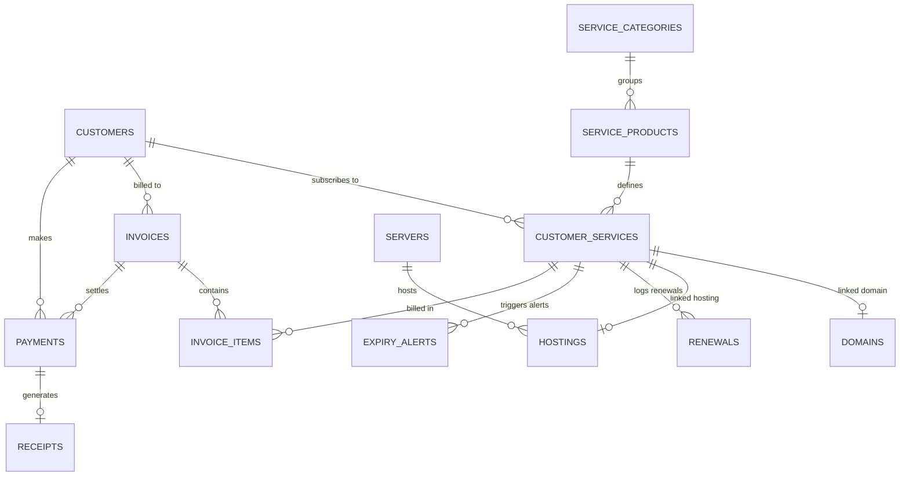

# Database Design - Billit

This document outlines the database schema, table structures, column definitions, and entity relationships for the Billit - Service Billing & Renewal Management system.

---

## 📊 Entity Relationship Diagram (ERD)

---

## 🗃️ Table Dictionary

### 1. `users`
Tracks company employees and administrators.
- `id` (BigInt, PK)
- `name` (String)
- `email` (String, Unique)
- `password` (String)
- `remember_token` (String, Nullable)
- `timestamps`

### 2. `customers`
Stores client company profiles and identifiers.
- `id` (BigInt, PK)
- `customer_code` (String, Unique) - Format: `CUST-XXXXX`
- `company_name` (String)
- `contact_person` (String)
- `email` (String)
- `mobile` (String)
- `alternate_mobile` (String, Nullable)
- `gstin` (String, Nullable)
- `pan` (String, Nullable)
- `address` (Text)
- `city` (String)
- `state` (String, Nullable)
- `country` (String)
- `pin_code` (String)
- `website` (String, Nullable)
- `notes` (Text, Nullable)
- `status` (Enum: `Active`, `Inactive`)
- `deleted_at` (Timestamp, Nullable) - Soft Deletes
- `timestamps`

### 3. `service_categories`
Catalog groupings for different products.
- `id` (BigInt, PK)
- `name` (String)
- `description` (Text, Nullable)
- `status` (Enum: `Active`, `Inactive`)
- `timestamps`

### 4. `service_products`
Individual items available in the catalog.
- `id` (BigInt, PK)
- `service_category_id` (BigInt, FK -> `service_categories.id`)
- `name` (String)
- `billing_cycle` (Enum: `Monthly`, `Quarterly`, `Semi-Annually`, `Annually`, `Biennially`, `Triennially`, `One-Time`)
- `price` (Decimal, 10,2)
- `description` (Text, Nullable)
- `status` (Enum: `Active`, `Inactive`)
- `timestamps`

### 5. `customer_services`
Active customer subscription records.
- `id` (BigInt, PK)
- `customer_id` (BigInt, FK -> `customers.id`)
- `service_product_id` (BigInt, FK -> `service_products.id`)
- `service_name` (String) - Override product name if needed
- `start_date` (Date)
- `expiry_date` (Date)
- `billing_cycle` (String)
- `amount` (Decimal, 10,2)
- `auto_renew` (Boolean) - Default: true
- `status` (Enum: `Active`, `Expired`, `Suspended`, `Cancelled`, `Pending`)
- `remarks` (Text, Nullable)
- `created_by` (BigInt, FK -> `users.id`)
- `deleted_at` (Timestamp, Nullable) - Soft Deletes
- `timestamps`

### 6. `servers`
Tracks physical and virtual server infrastructure details.
- `id` (BigInt, PK)
- `name` (String)
- `provider` (String) - e.g. AWS, Hetzner
- `hostname` (String)
- `ip_address` (String)
- `location` (String)
- `monthly_cost` (Decimal, 10,2)
- `renewal_date` (Date)
- `notes` (Text, Nullable)
- `status` (Enum: `Active`, `Maintenance`, `Suspended`)
- `timestamps`

### 7. `domains`
Domain name registrations.
- `id` (BigInt, PK)
- `customer_service_id` (BigInt, FK -> `customer_services.id`, Nullable)
- `domain_name` (String, Unique)
- `registrar` (String) - e.g. GoDaddy, Namecheap
- `registrar_account` (String, Nullable)
- `purchase_date` (Date)
- `expiry_date` (Date)
- `auto_renew` (Boolean) - Default: true
- `dns_provider` (String, Nullable)
- `nameserver_1` to `nameserver_4` (String, Nullable)
- `status` (Enum: `Active`, `Expired`, `Transferred`, `Pending`)
- `timestamps`

### 8. `hostings`
Hosting accounts created on servers.
- `id` (BigInt, PK)
- `customer_service_id` (BigInt, FK -> `customer_services.id`, Nullable)
- `server_id` (BigInt, FK -> `servers.id`)
- `hosting_type` (Enum: `Shared`, `VPS`, `Reseller`, `Dedicated`)
- `control_panel` (Enum: `cPanel`, `Plesk`, `CyberPanel`, `DirectAdmin`, `None`)
- `username` (String)
- `disk_limit` (String) - e.g., "50 GB", "Unlimited"
- `bandwidth_limit` (String) - e.g., "500 GB", "Unlimited"
- `status` (Enum: `Active`, `Suspended`, `Terminated`)
- `timestamps`

### 9. `renewals`
Logs historical renewal tracking logs.
- `id` (BigInt, PK)
- `customer_service_id` (BigInt, FK -> `customer_services.id`)
- `renewal_date` (Date)
- `old_expiry` (Date)
- `new_expiry` (Date)
- `amount` (Decimal, 10,2)
- `invoice_id` (BigInt, FK -> `invoices.id`, Nullable)
- `status` (Enum: `Pending`, `Generated`, `Paid`, `Expired`)
- `created_by` (BigInt, FK -> `users.id`)
- `timestamps`

### 10. `invoices`
Billing invoices generated for clients.
- `id` (BigInt, PK)
- `invoice_no` (String, Unique) - Format: `INV-YYZZ-XXXXXX`
- `customer_id` (BigInt, FK -> `customers.id`)
- `invoice_date` (Date)
- `due_date` (Date)
- `subtotal` (Decimal, 10,2)
- `discount` (Decimal, 10,2)
- `tax` (Decimal, 10,2) - GST value (default 18%)
- `total` (Decimal, 10,2)
- `balance` (Decimal, 10,2)
- `status` (Enum: `Draft`, `Sent`, `Paid`, `Partial`, `Overdue`, `Cancelled`)
- `notes` (Text, Nullable)
- `created_by` (BigInt, FK -> `users.id`)
- `deleted_at` (Timestamp, Nullable) - Soft Deletes
- `timestamps`

### 11. `invoice_items`
Line items within an invoice.
- `id` (BigInt, PK)
- `invoice_id` (BigInt, FK -> `invoices.id`)
- `customer_service_id` (BigInt, FK -> `customer_services.id`, Nullable)
- `description` (Text)
- `qty` (Integer) - Default: 1
- `rate` (Decimal, 10,2)
- `amount` (Decimal, 10,2)
- `timestamps`

### 12. `payments`
Collection history of invoice settlements.
- `id` (BigInt, PK)
- `invoice_id` (BigInt, FK -> `invoices.id`)
- `customer_id` (BigInt, FK -> `customers.id`)
- `amount` (Decimal, 10,2)
- `payment_method` (Enum: `UPI`, `Bank Transfer`, `Cash`, `Cheque`, `Razorpay`, `Other`)
- `transaction_no` (String, Nullable)
- `payment_date` (Date)
- `remarks` (Text, Nullable)
- `created_by` (BigInt, FK -> `users.id`)
- `timestamps`

### 13. `receipts`
Official payment collection receipts generated.
- `id` (BigInt, PK)
- `receipt_no` (String, Unique) - Format: `REC-YYZZ-XXXXXX`
- `payment_id` (BigInt, FK -> `payments.id`)
- `receipt_date` (Date)
- `amount` (Decimal, 10,2)
- `timestamps`

### 14. `expiry_alerts`
Tracks generated automated alerts of upcoming service expiries.
- `id` (BigInt, PK)
- `customer_service_id` (BigInt, FK -> `customer_services.id`)
- `days_before` (Integer) - e.g., 60, 30, 15, 7, 1
- `alert_date` (Date)
- `is_read` (Boolean) - Default: false
- `timestamps`
