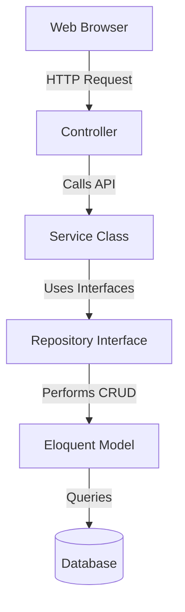

# Project Overview - Billit

## 🎯 Introduction
**Billit** is a professional, high-performance web application designed for IT service providers, digital agencies, and hosting companies to streamline their recurring subscription billing, IT asset registries, invoice generation, payment collection, and customer accounting.

In typical IT operations, managing varying renewal cycles for domains, cloud hosting servers, AMC contracts, and SSL certificates across dozens of clients is highly error-prone. Billit addresses this by unifying infrastructure registration, client catalog mappings, automatic expiry checks, milestone warnings, payment collections, and accounting ledger generation under a single dashboard.

---

## 🛠️ Technology Stack
The application is engineered using modern, stable web technologies:

- **Backend**: **Laravel 12 (PHP 8.2+)** utilizing Eloquent ORM, Service Providers, and Artisan Commands.
- **Frontend**: Clean and modern dashboard built with **Bootstrap 5**, styled with custom **Vanilla CSS** tokens (Outfit typography, smooth card animations, and responsive sidebars), using **FontAwesome 6** for icons.
- **Data Rendering**: **Yajra DataTables** for server-side rendering, search, pagination, and sorting of customer listings and logs.
- **PDF Engine**: **Barryvdh Laravel DomPDF** for composing and exporting commercial-grade invoices and payment receipts.
- **Form Controls & Alerts**: **Select2** for searchable select inputs and **SweetAlert2** for elegant user alerts and confirmations.
- **Testing Suite**: **PHPUnit** with in-memory SQLite configurations for clean, decoupled feature testing.

---

## 🏗️ Architecture & Design Patterns
Billit follows a strict **Repository and Service Pattern** to achieve high modularity and testability, preventing controllers from becoming bloated with SQL queries or transaction logic.

### 1. Controllers
Controllers handle HTTP requests, invoke input validation via Form Requests, and delegate all business actions to specialized Service classes. They return JSON for DataTables or render blade templates.

### 2. Service Classes (Business Logic Layer)
All transactional math, invoice compilation, payment state transitions, and renewal expiry policies reside here. Examples include:
- `BillingService`: Combines active subscriptions into invoices, applies tax (GST), and tracks invoice balances.
- `PaymentService`: Records invoice payments, updates balances, and initiates receipt creation.
- `AlertService`: Generates daily warning alerts for services about to expire.

### 3. Repository Layer
Models are accessed through Repositories. Interfaces (like `CustomerRepositoryInterface`) decouple the actual data-source (Eloquent ORM) from the business layer, ensuring we can swap database engines or mock data easily during testing.

### 4. Eloquent Models & Migrations
Represent database tables and define database relations, attributes, soft-delete behaviors, and timestamp audits.

---

## 🔐 Key Modules & Capabilities

1. **Dashboard Analytics**: Glassmorphism cards presenting metrics for active customers, active services, unpaid invoices, and collections. Includes charts and tables listing upcoming domain and service expiries.
2. **Customer Ledger**: Comprehensive database profile for clients. Displays a customer ledger statement representing invoice entries, payments, and outstanding balances.
3. **Infrastructure & Asset Registry**: Tracks cloud servers, IP addresses, hosting accounts, and domain names, ensuring that support staff can trace hosting accounts to physical servers.
4. **Billing & Receipts**: Invoicing engine that issues serial-numbered invoice PDFs, processes payments (cash, UPI, cheque, bank transfer), and generates official receipts.
5. **Scheduler & Automation**: Scans the database daily via `php artisan services:check-expiry` to alert staff and suspend services automatically.
